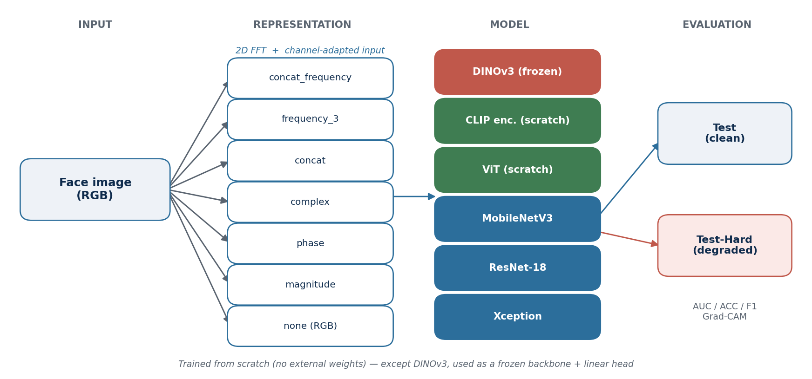

# Spatial, Spectral, or Self-Supervised? Benchmarking Face Forgery Detectors under Real-World Degradation


A reproducible benchmark for **AI-generated / deepfake face detection** that asks one question:

> Do **frequency-domain (Fourier)** input representations help different neural architectures
> detect forged faces — and does any of it survive the **real-world degradation** (compression,
> resizing, blurring) that images undergo once they circulate online?

To answer it, the project trains **five architecture families** × **seven input representations**
on the [MFFI dataset](https://arxiv.org/abs/2509.05592), and evaluates each model on a **clean
Test** partition and a **degraded Test-Hard** partition. The accompanying paper
(`final.tex`, SIBGRAPI 2026 format) reports the full study.

> **TL;DR of the findings.** From-scratch CNNs win in-distribution (Xception, AUC 0.89) but
> collapse toward chance under degradation; a **frozen self-supervised DINOv3** backbone is by
> far the most robust (0.81 → 0.73). Hybrid spatial+spectral inputs give CNNs marginal gains,
> while **purely spectral inputs consistently underperform raw RGB**.

---

## Table of contents

- [Why this project](#why-this-project)
- [How it works](#how-it-works)
- [Key concepts in 60 seconds](#key-concepts-in-60-seconds)
- [Repository layout](#repository-layout)
- [Installation](#installation)
- [Data](#data)
- [Quickstart](#quickstart)
- [Training](#training)
- [Evaluation (Test & Test-Hard)](#evaluation-test--test-hard)
- [Interpretability (Grad-CAM)](#interpretability-grad-cam)
- [The paper](#the-paper)
- [Compiling on Overleaf](#compiling-on-overleaf)
- [Results summary](#results-summary)
- [Tests](#tests)
- [FAQ / troubleshooting](#faq--troubleshooting)
- [Citing](#citing)
- [License](#license)

---

## Why this project

Modern face forgeries are visually indistinguishable from real photos, and lab-trained detectors
routinely report AUC > 0.99 — yet those numbers evaporate once images are compressed, resized, or
blurred for distribution. This repository is a **controlled, factorial study** of that gap:

- **5 architecture families** — Xception, ResNet-18, MobileNetV3, a from-scratch Vision
  Transformer, a from-scratch CLIP-style encoder, and a **frozen self-supervised DINOv3** backbone.
- **7 input representations** — raw RGB plus six Fourier-based encodings (see below).
- **2 evaluation regimes** — a clean **Test** set and a degraded **Test-Hard** set, so robustness
  is measured explicitly rather than assumed.

Every model is trained from scratch (except DINOv3, used frozen), so comparisons reflect what each
inductive bias and each representation actually contribute — not transferred ImageNet knowledge.

---

## How it works

The pipeline is a clean factorial design: each face image is turned into one of seven
representations, fed to one of the architectures, and scored on both a clean and a degraded test
set.



---

## Key concepts in 60 seconds

| Term | Meaning |
|---|---|
| **Binary classification** | Each image is labeled `0` (real) or `1` (forged). |
| **Spatial domain (RGB)** | The image as pixels — what you see on screen. |
| **Frequency domain (FFT)** | The same image expressed as a sum of wave-like patterns. Generators often leave tell-tale artifacts here that are invisible in pixel space. |
| **Magnitude / phase** | The two components of each point of the FFT spectrum. |
| **Test vs Test-Hard** | Clean test images vs the *same* images after real-world degradation (compression/resize/blur). The gap between them measures robustness. |
| **From scratch vs frozen** | Task models are trained from random weights; DINOv3 is a pre-trained backbone kept frozen, with only a small linear head trained on top. |
| **Threshold** | The probability cutoff that turns a score into a 0/1 decision; chosen on validation, not fixed at 0.5. |
| **AUC** | Area under the ROC curve — threshold-independent quality (0.5 = chance, 1.0 = perfect). The primary metric here. |

### The seven input representations (`FourierMode`)

Defined in [`src/data/data.py`](src/data/data.py). The first layer of each network is adapted to the
channel count automatically.

| Mode | Channels | What the model sees |
|---|---|---|
| `none` | 3 | RGB (spatial baseline) |
| `magnitude` | 1 | Log-magnitude spectrum `log(|F|+1)` |
| `phase` | 1 | Phase spectrum mapped to `[0,1]` |
| `complex` | 2 | Real and imaginary spectra |
| `concat` | 4 | RGB + magnitude |
| `frequency_3` | 1 | High-pass magnitude (low-frequency disk removed) |
| `concat_frequency` | 6 | RGB + magnitude + phase + high-pass |

> Augmentation is **disabled** whenever a spectral channel is used, so the FFT stays aligned with
> the (un-augmented) spatial content.

---

## Repository layout

```
TCC/
├── main.py                     # Entry point: trains the selected models × Fourier modes
├── evaluate_trained_models.py  # Post-hoc evaluation over val/test/test_d (-> Resultados-style CSV)
├── generate_resnet_heatmaps.py # Grad-CAM overlays for a trained ResNet run
├── make_figs.py                # Builds the paper figures from Resultados.xlsx
├── merge_metrics.py            # Consolidates per-run metrics_summary.csv files
├── filter_min_csv.py           # Builds the small local dev split (data/raw_min)
├── plot_frequencia.py          # Visualizes the 7 Fourier modes for two example images
│
├── src/
│   ├── data/
│   │   ├── data.py             # ImageDataset + the 7 Fourier modes
│   │   └── paths.py            # Resolves image roots (env: TCC_DATASET_ROOT)
│   ├── models/                 # Architectures: xception, resnet, mobilenet, vit, clip, dino
│   ├── pipelines/
│   │   ├── {xcpetion,resnet,mobilenet,vit,clip,dino}.py  # one run_* per model
│   │   ├── training.py         # shared utils: DataParallel, mixup, checkpoint helpers
│   │   ├── evaluation.py       # metrics, threshold search, numerical safety
│   │   └── evaluate_trained.py # discovers checkpoints and scores them on each split
│   ├── plots/                  # confusion matrix, ROC, Grad-CAM utilities
│   └── utils/multiprocess.py   # one-process-per-GPU task runner
│
├── data/
│   ├── raw/        {train,val,test}.csv     # full dataset (img_name,target)
│   ├── raw_min/    {train,val,test}.csv     # small subset for local dev
│   └── min/                                  # local image subset
├── models/                     # Outputs per run: weights/, results/ (npz, csv, plots)
├── Resultados.xlsx             # Consolidated results (source of truth for the paper)
│
├── final.tex                   # The SIBGRAPI 2026 paper
├── bibtex.bib                  # Bibliography
├── table_results.tex           # Auto-includable results table
└── figs/                       # Paper figures (generated by make_figs.py)
```

---

## Installation

Requires **Python 3.11–3.12** (PyTorch CUDA wheels do not yet cover 3.13) and, for GPU training,
a CUDA 12.1 capable machine. The project uses [`uv`](https://github.com/astral-sh/uv).

```bash
# clone, then:
uv venv                       # creates .venv using the pinned Python (3.12)
uv pip install -e .           # installs torch, torchvision, scikit-learn, pandas, etc.

# extras used by the figure/analysis scripts:
uv pip install matplotlib openpyxl
```

CPU-only machines can run the smoke tests and the small `raw_min` split, but full training needs a
GPU. Multi-GPU is supported (see [Training](#training)).

---

## Data

The CSV splits (`img_name,target`) live in `data/`; the **images themselves are external** and are
*not* committed. Point the code at them with an environment variable:

```bash
export TCC_DATASET_ROOT=/path/to/MFFI    # must contain trainset/ valset/ testset/
```

Path resolution lives in [`src/data/paths.py`](src/data/paths.py); the default is a lab server path,
overridden by `TCC_DATASET_ROOT`.

- **`data/raw/`** — full MFFI splits: 524,429 train · 147,363 val · 181,947 test.
- **`data/raw_min/`** — tiny subset for laptop development (generate with `python filter_min_csv.py`).

Set `RAW_MIN = True` in `main.py` (or pass `raw_min=True`) to train on the small split.

---

## Quickstart

```bash
# 1. Point at your images
export TCC_DATASET_ROOT=/path/to/MFFI

# 2. Smoke-test the install (fast, no real data needed)
uv run pytest -q

# 3. Train on the small split to verify the full pipeline end-to-end
#    (edit main.py: set RAW_MIN = True, pick one model flag)
uv run python main.py

# 4. Score every checkpoint found under models/ on val/test/test_d
uv run python evaluate_trained_models.py --data-dir data/raw \
    --test-d-csv /path/to/test_hard.csv --test-d-images-dir /path/to/test_hard/images

# 5. Rebuild the paper figures from the consolidated results
uv run python make_figs.py
```

---

## Training

All training is driven by [`main.py`](main.py). Configure it at the top of the file:

```python
EPOCHS       = 50
RAW_MIN      = False     # True -> use the small data/raw_min split
BATCH_SIZE   = 32
NUM_WORKERS  = 4
MULTI_GPU    = True      # wrap models in nn.DataParallel when >1 GPU

# Which models to run (each is trained once per Fourier mode, except CLIP/DINO = RGB only)
RUN_XCEPTION  = False
RUN_RESNET    = False
RUN_MOBILENET = False
RUN_VIT       = True
RUN_CLIP      = True
RUN_DINO      = True

MULTIPROCESS = True      # one process per GPU; False = run tasks sequentially
GPUS         = None      # e.g. [0, 1]; None = auto-detect
```

Then:

```bash
uv run python main.py
```

**What each run does** (shared recipe across pipelines):

1. Loads the split CSVs and builds an `ImageDataset` in the chosen Fourier mode.
2. Balances classes with a weighted random sampler.
3. Trains with AdamW (differential LR for head vs backbone), cross-entropy, mixup (ViT/DINO),
   gradient clipping, and AMP on GPU.
4. Selects the **decision threshold on validation** (not a fixed 0.5) and keeps the best checkpoint.
5. Evaluates on the test split and writes everything under
   `models/<model>/<...>/<mode>/`:
   - `weights/best_*.pth` — best checkpoint
   - `results/metrics_summary.csv` — metrics + hyperparameters
   - `results/outputs.npz` — logits/probs/preds/labels for later analysis
   - `results/*.png` — confusion matrix and ROC curve

> **Models trained from scratch** (no external weights; passing `pretrained=True` raises): Xception,
> ResNet, MobileNet, ViT, CLIP. **DINOv3** is the exception — used as a frozen backbone with a
> trainable linear head.

---

## Evaluation (Test & Test-Hard)

After training, score **all** discovered checkpoints across splits in one pass with
[`evaluate_trained_models.py`](evaluate_trained_models.py):

```bash
uv run python evaluate_trained_models.py \
    --models-root models \
    --data-dir data/raw \
    --test-d-csv  /path/to/test_hard.csv \
    --test-d-images-dir /path/to/test_hard/images \
    --splits val,test,test_d \
    --output-csv all_metrics_by_split.csv
```

| Flag | Default | Meaning |
|---|---|---|
| `--models-root` | `models` | Where to look for `**/weights/best_*.pth` |
| `--data-dir` | `data/raw` | Location of `val.csv` / `test.csv` |
| `--test-d-csv`, `--test-d-images-dir` | — | The **Test-Hard** (degraded) split |
| `--splits` | `val,test,test_d` | Which partitions to score |
| `--only-model-family` | — | Restrict to e.g. `resnet` |
| `--list-runs` | off | List discovered runs without evaluating |

This produces a long-format CSV (`model_family, architecture, technique, split, auc, acc, f1, …`)
— the same structure as the committed [`Resultados.xlsx`](Resultados.xlsx), which is the source of
truth for the paper's tables and figures.

To merge the individual `metrics_summary.csv` files instead, use `python merge_metrics.py`.

---

## Interpretability (Grad-CAM)

Generate class-activation overlays for a trained ResNet run (sampled across TP/TN/FP/FN):

```bash
uv run python generate_resnet_heatmaps.py
```

Utilities live in [`src/plots/heatmap.py`](src/plots/heatmap.py) and
[`src/plots/resnet_heatmap_generator.py`](src/plots/resnet_heatmap_generator.py). Overlays are
written under `models/resnet/plots/`. You can also visualize the raw Fourier modes side by side for
two example images with `python plot_frequencia.py`.

---

## The paper

The write-up lives in [`final.tex`](final.tex) (IEEEtran, SIBGRAPI 2026). It compiles with any
modern LaTeX engine; the figures are generated from `Resultados.xlsx`.

```bash
uv run python make_figs.py          # (re)build figs/*.pdf from Resultados.xlsx
tectonic final.tex                  # or: pdflatex final && bibtex final && pdflatex x2
```

`make_figs.py` produces:

- `figs/fig_test_vs_testhard.pdf` — the generalization gap (Test vs Test-Hard AUC per model)
- `figs/fig_fourier_modes.pdf` — Test AUC across all seven representations
- `figs/fig_gradcam.pdf` — ResNet-18 Grad-CAM montage

---

## Compiling on Overleaf

`final.tex` is **not self-contained** — it pulls in companion files:

| Dependency | Provided by |
|---|---|
| `table_results.tex` | `\input{table_results}` |
| `figs/fig_test_vs_testhard.pdf`, `figs/fig_fourier_modes.pdf`, `figs/fig_gradcam.pdf` | `\includegraphics` (`\graphicspath{{figs/}}`) |
| `bibtex.bib` | `\bibliography{bibtex}` |
| `IEEEtran.cls`, `IEEEtran.bst` | bundled with Overleaf automatically |

If you paste **only** `final.tex` into a blank Overleaf project, it fails with *File not found*
on the `\input` and the figures. Two ways to fix it:

**Option A — upload the whole project (recommended).** A ready-made archive is included:

1. In Overleaf: **New Project → Upload Project**.
2. Upload [`overleaf_project.zip`](overleaf_project.zip) (it contains `final.tex`,
   `table_results.tex`, `bibtex.bib`, and the `figs/` folder).
3. **Menu → Compiler → pdfLaTeX**, set the **main document** to `final.tex`, and Recompile.

Rebuild the zip any time with:

```bash
zip -j overleaf_project.zip final.tex table_results.tex bibtex.bib
zip    overleaf_project.zip figs/fig_*.pdf
```

**Option B — recreate the files manually.** In your Overleaf project, create files with the exact
names above (paste `table_results.tex` and `bibtex.bib`, upload the three PDFs into a `figs/`
folder), then set the compiler to **pdfLaTeX**.

> Notes: the source is pure ASCII and uses driver-agnostic `graphicx`, so it compiles under
> **pdfLaTeX** (Overleaf default), XeLaTeX, and LuaLaTeX alike. Overleaf runs BibTeX automatically,
> so the references resolve on the second pass. The paper is in blind-review mode (`\finalfalse`);
> flip to `\finaltrue` for the camera-ready with author names.

---

## Results summary

Headline numbers (ROC-AUC) from `Resultados.xlsx`:

| Model | Best Test AUC | Test-Hard AUC (RGB) |
|---|---|---|
| **Xception** | **0.887** (`concat`) | 0.586 |
| ResNet-18 | 0.857 (`concat_frequency`) | 0.635 |
| MobileNetV3 | 0.822 (`concat`) | 0.594 |
| ViT (scratch) | 0.696 (`concat`) | 0.610 |
| **DINOv3 (frozen)** | 0.809 (`none`) | **0.726** |

Three takeaways:

1. **The ranking inverts under degradation.** Xception is best on clean Test but near-chance on
   Test-Hard; frozen **DINOv3** loses the least (0.81 → 0.73) and is the most robust overall.
2. **Frequency helps only as a supplement.** Hybrid `concat` / `concat_frequency` give CNNs small
   gains; purely spectral inputs (magnitude, phase, complex, high-pass) underperform RGB.
3. **Self-supervised features generalize.** A frozen backbone + linear head beats bespoke,
   forgery-trained features once the distribution shifts — the practical argument of the paper.

> Note: the CLIP-style encoder is implemented but not yet in the consolidated results (marked
> pending in the paper).

---

## Tests

```bash
uv run pytest -q          # full suite
uv run pytest tests/ -x   # stop on first failure
```

The suite includes per-model smoke tests (a few training steps to catch breakage), numerical-safety
tests for `evaluation.py` and the plotting code (NaN/Inf, degenerate single-class batches), and
dataset-path checks. They run on CPU and do not require the full dataset.

---

## FAQ / troubleshooting

- **`Erro na imagem: ...`** — the CSV references a file not found under `TCC_DATASET_ROOT`. Check the
  env var and that the split subfolders (`trainset/`, `valset/`, `testset/`) exist.
- **CUDA out of memory** — lower `BATCH_SIZE`, reduce `image_size`, or set `MULTI_GPU = False`.
- **No GPU** — set `MULTIPROCESS = False` and `MULTI_GPU = False`, and use `RAW_MIN = True`.
- **`pretrained=True` raises** — intentional: task models are trained from scratch. Only DINOv3 uses
  pre-trained (frozen) weights.
- **Figures won't build** — `uv pip install matplotlib openpyxl`, then `python make_figs.py`.

---

## Citing

If you use this code or the MFFI-based benchmark, please cite the dataset and this work.

```bibtex
@inproceedings{ref_mffi,
  author    = {Miao, Changtao and Zhang, Yi and Luo, Man and Feng, Weiwei and
               Zheng, Kaiyuan and Chu, Qi and Gong, Tao and Li, Jianshu and
               Diao, Yunfeng and Zhou, Wei and Zhou, Joey Tianyi and Hao, Xiaoshuai},
  title     = {{MFFI}: Multi-Dimensional Face Forgery Image Dataset for Real-World Scenarios},
  booktitle = {Proceedings of the 33rd ACM International Conference on Multimedia (MM)},
  year      = {2025},
}
```

See [`bibtex.bib`](bibtex.bib) for the full reference list used in the paper.

---

## License

This project is released under the **MIT License** — see [`LICENSE`](LICENSE) for the full text.
You are free to use, modify, and distribute the code, including for commercial purposes, provided
the copyright notice is retained.

The **MFFI dataset** is governed by its own license and terms; this repository does not redistribute
the images. Obtain the dataset from its authors and review their terms before use.
