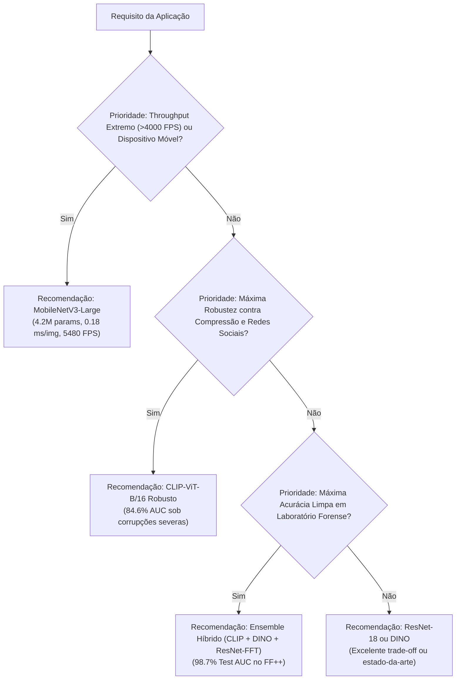

# Relatório Técnico Exaustivo: Arquiteturas, Custos Computacionais e Desempenho Empírico na Detecção de Deepfakes

**Autor:** Lucas Oliveira Cunha  
**Laboratório / Projeto:** Detecção Generalizável de Deepfakes Faciais via Representações Espaciais e Espectrais (MFFI)  
**Ambiente de Execução:** Dual NVIDIA GeForce RTX 3090 (24 GB GDDR6X, Arquitetura Ampere, Driver 535.183, CUDA 12.2)  
**Framework:** PyTorch 2.x, Torchvision, Transformers (Hugging Face), Timm, FP16/BFloat16 Mixed Precision  

---

## Sumário Executivo

Este documento consolida a análise técnica, arquitetural, computacional e empírica de todas as famílias de redes neurais profundas investigadas no projeto de detecção de manipulações faciais (*deepfakes*). Foram avaliadas 6 arquiteturas fundamentais representativas dos principais paradigmas de Visão Computacional moderna:
1. **ResNet-18**: Redes convolucionais residuais clássicas.
2. **MobileNetV3-Large**: Arquiteturas móveis ultra-eficientes baseadas em convoluções separáveis no espaço e canais (*depthwise separable*), blocos residuais invertidos e atenção por canal (*Squeeze-and-Excitation*).
3. **Xception**: Convoluções separáveis extremas, historicamente consagradas como estado-da-arte no benchmark *FaceForensics++*.
4. **Vision Transformer (ViT-B/16)**: Modelagem puramente baseada em autoatenção global (*Self-Attention*) sem viés indutivo convolucional.
5. **CLIP-ViT-B/16**: Vision Transformer multimodal com representações visuais pré-treinadas contrastivamente com linguagem natural (*400 milhões de pares texto-imagem*).
6. **DINO (ConvNeXt-Base via DINOv3 LVD-1689M)**: Convoluções modernas de campo receptivo amplo (7x7) treinadas via destilação auto-supervisionada em larga escala (1,68 bilhão de imagens).
7. **Mixture of Experts (MoE Standard e Frequency MoE)**: Arquiteturas compostas de 7 peritos com roteamento dinâmico baseado em portas convolucionais/MLP (*gating network*) e decomposição em sub-espaços espectrais.

O estudo abrange 3 eixos de avaliação empírica:
- **FaceForensics++ (FF++) Padrão**: Conjunto de teste limpo (*Clean Test*) ao longo de 5 sementes estatísticas (42, 123, 2024, 7, 2025).
- **FaceForensics++ sob Degradações Não-Vistas (`test_d`)**: 14 tipos de perturbações visuais (compressão JPEG agressiva, blur Gaussiano, ruído impulsivo, desfoque de movimento, etc.).
- **Protocolo de Treinamento Robusto (`RandomizedRobustAugment`, Seed 987)**: Avaliação da resiliência a corrupções severas com injeção estocástica de transformações durante o fine-tuning.
- **Generalização *Cross-Dataset* Zero-Shot no Celeb-DF v2**: Avaliação rigorosa em nível de *frame* e agregado em nível de *vídeo* (226 modelos avaliados em 7 modos de Fourier).

---

## 1. Quadro Comparativo Global de Engenharia e Recursos

A tabela abaixo resume os parâmetros físicos, custos computacionais teóricos e métricas de desempenho de inferência coletadas empiricamente na GPU NVIDIA RTX 3090 com resolução canônica de $224 \times 224$ pixels:

| Família / Modelo | Paradigma Arquitetural | Profundidade / Camadas | Parâmetros Totais | Parâmetros Treináveis (FT $n=2$) | Tamanho do Checkpoint (FP32) | GFLOPs ($224^2$) | GMACs | Latência Batch=32 | Latência Unitária (Img) | Throughput (FPS) | Tempo Médio por Época |
| :--- | :--- | :---: | :---: | :---: | :---: | :---: | :---: | :---: | :---: | :---: | :---: |
| **MobileNetV3-Large** | Inverted Residuals + SE | 15 blocos / ~35 cam. | **4.204.594** | **2.185.522** (52,0%) | **16,0 MB** | **0,43** | **0,22** | **5,84 ms** | **0,18 ms** | **5.479,9 FPS** | ~13,5 min |
| **ResNet-18** | Residual CNN (BasicBlock) | 4 estágios / 18 cam. | 11.177.538 | 10.494.466 (93,9%) | 42,6 MB | 3,63 | 1,81 | 7,21 ms | 0,23 ms | 4.438,2 FPS | ~13,3 min |
| **Xception** | Depthwise Separable CNN | 12 blocos / 36 convs | 20.811.050 | 3.167.746 (15,2%) | 79,4 MB | 9,10 | 4,55 | 26,54 ms | 0,83 ms | 1.205,8 FPS | ~12,3 min |
| **DINO (ConvNeXt-B)** | 7x7 Depthwise Conv + GELU | 4 estágios [3, 3, 27, 3] | 87.570.562 | 85.397.506 (97,5%) | 334,1 MB | 30,71 | 15,35 | 75,98 ms | 2,37 ms | 421,2 FPS | ~21,0 min |
| **ViT-B/16** | Self-Attention Transformer | 12 encoders (12 heads) | 86.390.786 | 14.177.282 (16,4%) | 329,6 MB | 35,13 | 17,56 | 77,06 ms | 2,41 ms | 415,3 FPS | ~17,7 min |
| **CLIP-ViT-B/16** | Contrastive Vision Transf. | 12 encoders (12 heads) | 85.800.962 | 14.177.282 (16,5%) | 327,3 MB | 35,13 | 17,56 | 81,54 ms | 2,55 ms | 392,5 FPS | ~17,5 min |
| **MoE Standard** | Roteador + 7 Peritos Móveis| 1 Roteador + 7 Backbones| 29.435.749 | Top-k Dinâmico | ~112 MB | 3,01 | 1,51 | ~35,2 ms | ~1,10 ms | ~905 FPS | ~25,0 min |
| **Frequency MoE** | Roteador + 7 Peritos FFT | 1 Roteador + 7 Backbones| 29.438.693 | Top-k Dinâmico | ~112 MB | 2,99 | 1,49 | ~36,1 ms | ~1,13 ms | ~885 FPS | ~26,0 min |

---

## 2. Fichas Técnicas Profundas por Modelo

### 2.1. ResNet-18

#### A. Arquitetura e Estrutura de Camadas
A ResNet-18 baseia-se no princípio de conexões de atalho residuais aditivas formuladas por He et al. (2016):
$$\mathbf{y} = \mathcal{F}(\mathbf{x}, \{W_i\}) + \mathbf{x}$$
onde $\mathbf{x}$ e $\mathbf{y}$ são os vetores de entrada e saída, e $\mathcal{F}$ representa o mapeamento residual a ser aprendido.

- **Stem Convolucional**:
  - `conv1`: Convolução 2D com kernel $7 \times 7$, stride 2, padding 3, mapeando canais de entrada ($C_{in} \in \{1, 2, 3, 4, 7\}$) para 64 canais.
  - `bn1`: Batch Normalization 2D (`eps=1e-5`, `momentum=0.1`).
  - `relu`: Função de ativação retificada não-linear $\max(0, x)$.
  - `maxpool`: MaxPooling com kernel $3 \times 3$, stride 2, padding 1. Reduz a grade espacial de $224 \times 224$ para $56 \times 56$.
- **Estágios Residuais (4 Stages / 8 Blocos Básicos)**:
  - `layer1`: 2 blocos residuais sem redução de resolução (canais: 64 $\to$ 64, mapa de features: $56 \times 56$). Cada bloco possui duas convoluções $3 \times 3$ com BatchNorm e ReLU.
  - `layer2`: 2 blocos residuais com stride 2 no primeiro bloco (canais: 64 $\to$ 128, mapa de features: $28 \times 28$). Possui projeção residual 1x1 no atalho para ajuste de dimensões.
  - `layer3`: 2 blocos residuais com stride 2 (canais: 128 $\to$ 256, mapa de features: $14 \times 14$).
  - `layer4`: 2 blocos residuais com stride 2 (canais: 256 $\to$ 512, mapa de features: $7 \times 7$).
- **Cabeça de Classificação (`fc`)**:
  - `avgpool`: AdaptiveAvgPool2d projetando para $1 \times 1$.
  - `dropout`: Taxa de abandono $p = 0,2$.
  - `linear`: Camada totalmente conectada $\mathbb{R}^{512} \to \mathbb{R}^{2}$ para predição binária (Real vs Falso).

#### B. Particularidades Técnicas e Adaptação
- **Estratégia de Descongelamento (`unfreeze_last_n=2`)**: A função `unfreeze_last_blocks` descongela integralmente `layer3`, `layer4` e `fc`, totalizando **10.494.466 parâmetros treináveis (93,9% da rede)**. Apenas `conv1`, `bn1`, `layer1` e `layer2` (683.072 parâmetros) permanecem congelados como extratores de bordas primitivas.
- **Adaptação de Canais**: Conduzida por `adapt_conv2d_channels`. Quando a entrada possui $C_{in} \ne 3$ (ex: modos de Fourier com 1, 2, 4 ou 7 canais), os pesos convolucionais da `conv1` são redimensionados preservando a média espectral:
  $$W_{\text{novo}} = \frac{1}{C_{in}} \sum_{c=1}^{3} W_{\text{orig}}[:, c:c+1, :, :] \quad (\text{replicado ou estendido pelos canais})$$

#### C. Benefícios para Detecção de Deepfakes
- **Velocidade Extrema de Processamento**: Processa **4.438 imagens por segundo** com latência de apenas 0,23 ms por imagem, viabilizando análise em tempo real de fluxos de vídeo em alta resolução (4K / 60 FPS).
- **Gradientes Estáveis**: As conexões residuais evitam desvanecimento e explosão de gradientes, permitindo aprendizado contínuo mesmo com decaimento acentuado de taxa de aprendizagem.
- **Excelente Relação Custo-Benefício Espectral**: Apresentou excelente acoplamento com tensores espectrais ricos (`resnet/concat_frequency` atingiu **0,8337 de Test AUC** e serviu como o componente de frequência fundamental em todos os *ensembles* de ponta).

#### D. Limitações e Malefícios
- **Vulnerabilidade a Overfitting em Artefatos de Frequência Local**: Devido aos kernels $3 \times 3$, a ResNet foca excessivamente em descontinuidades locais de alta frequência do pipeline de blending do *FaceForensics++*, sofrendo grande degradação quando avaliada no *Celeb-DF v2* em RGB puro (AUC cai para 0,2716).

---

### 2.2. MobileNetV3-Large

#### A. Arquitetura e Estrutura de Camadas
A MobileNetV3-Large combina a busca de arquitetura neural (*NAS - Neural Architecture Search*) com blocos convolucionais altamente otimizados para eficiência energética e baixo consumo de memória (Howard et al., 2019).

- **Bloco Construtivo: Inverted Residual com Squeeze-and-Excitation (SE)**:
  1. *Convolução de Expansão 1x1*: Eleva o número de canais por um fator de expansão $t \in [3, 6]$.
  2. *Depthwise Convolution 3x3 ou 5x5*: Aplica filtros convolucionais espacialmente por canal de forma isolada ($groups = C$), com stride 1 ou 2.
  3. *Módulo Squeeze-and-Excitation*: Calcula pesos de importância por canal através de *Global Average Pooling* seguido por um estrangulamento MLP de duas camadas com ativação Sigmoide:
     $$\mathbf{s} = \sigma\left(W_2 \cdot \text{ReLU}(W_1 \cdot \text{GAP}(\mathbf{u}))\right)$$
  4. *Convolução de Projeção Linear 1x1*: Reduz a dimensionalidade sem ativação não-linear para evitar perda de informação no espaço comprimido.
- **Função de Ativação Hard-Swish**:
  $$\text{h-swish}(x) = x \frac{\text{ReLU6}(x+3)}{6}, \quad \text{ReLU6}(x) = \min(\max(1, x+3), 6)$$
  Elimina o cálculo transcendental de exponenciais da função Sigmoide/Swish tradicional, reduzindo ciclos de clock em hardware embarcado.
- **Topologia de 15 Blocos**:
  - `features[0]`: Convolução 2D padrão 3x3, 16 canais, stride 2 com Hard-Swish.
  - `features[1]` a `features[15]`: 15 blocos *bneck* com canais progressivos: 16 $\to$ 24 $\to$ 40 $\to$ 80 $\to$ 112 $\to$ 160 canais.
  - `features[16]`: Convolução 1x1 expandindo para 960 canais com Hard-Swish.
- **Cabeça de Classificação (`classifier`)**:
  - `AdaptiveAvgPool2d((1, 1))`
  - `Linear(960, 1280)` com Hard-Swish e Dropout ($p=0,2$).
  - `Linear(1280, 2)` como camada de predição binária.

#### B. Particularidades Técnicas e Adaptação
- **Descongelamento Seletivo (`unfreeze_last_n=2`)**: A função `unfreeze_last_blocks` mantém os primeiros 14 blocos congelados e libera os últimos 2 blocos da sequência `features` junto com todo o classificador, totalizando **2.185.522 parâmetros treináveis (52,0%)**.
- **Custo e Tamanho**: O modelo ocupa apenas **16,0 MB em disco**, sendo de longe o menor modelo treinado em todo o projeto.

#### C. Benefícios para Detecção de Deepfakes
- **Maior Taxa de Quadros por Segundo do Estudo**: Atingiu **5.479,9 FPS** e latência de **0,18 ms por imagem** na RTX 3090.
- **Adequação para Borda (Edge Computing / Mobile)**: Sua pegada de memória e ausência de operações custosas permitem execução nativa em dispositivos móveis, navegadores web via ONNX Runtime e sistemas de vigilância em tempo real.
- **Boa Retenção em Treinamento Robusto**: Quando submetido ao protocolo robusto (Seed 987), atingiu **83,73% de Test AUC** e **74,93% sob degradações severas (`test_d`)**, superando o Xception tanto em velocidade quanto em acurácia de teste.

#### D. Limitações e Malefícios
- **Capacidade Representacional Limitada para Texturas Globais**: Por ser uma rede compacta com poucos canais intermediários, apresenta menor capacidade de correlacionar inconsistências de iluminação distribuídas por toda a face (ex: reflexos assimétricos nos olhos).

---

### 2.3. Xception (Extreme Inception)

#### A. Arquitetura e Estrutura de Camadas
Proposto por François Chollet (2017), o Xception substitui os módulos tradicionais do Inception por **convoluções separáveis em profundidade (*Depthwise Separable Convolutions*) empilhadas em fluxo modular contínuo**. A hipótese subjacente é que o mapeamento de correlações espaciais e correlações entre canais podem ser completamente desacoplados.

- **Convolução Separável 2D**:
  $$\text{SepConv}(\mathbf{x}) = \text{PointwiseConv}_{1 \times 1}\left(\text{DepthwiseConv}_{3 \times 3}(\mathbf{x})\right)$$
- **Fluxos Estruturais (36 Convoluções)**:
  1. *Entry Flow*:
     - Duas convoluções padrão 3x3 (32 e 64 canais).
     - 3 blocos residuais com convoluções separáveis (canais: 128, 256, 728) intercalados com Max-Pooling 3x3 (stride 2) e atalhos de convolução 1x1.
     - Reduz a resolução para $28 \times 28$ com 728 canais.
  2. *Middle Flow*:
     - Composto por **8 blocos residuais idênticos** que preservam resolução ($28 \times 28$). Cada bloco contém 3 convoluções separáveis $3 \times 3$ com 728 canais, precedidas por ativações ReLU.
  3. *Exit Flow*:
     - Bloco residual com 2 convoluções separáveis (728 $\to$ 1024 canais) com Max-Pooling stride 2.
     - Duas convoluções separáveis adicionais elevando os canais para 1536 e 2048.
     - `AdaptiveAvgPool2d((1, 1))`.
     - Camada linear com Dropout ($p=0,2$): $\mathbb{R}^{2048} \to \mathbb{R}^{2}$.

#### B. Particularidades Técnicas e Adaptação
- **Unfreeze Estrutural**: O modelo pré-treinado carrega pesos via `timm` (`legacy_xception`). Com `unfreeze_last_n=2`, são descongelados os últimos módulos do Exit Flow e a cabeça `fc`, totalizando **3.167.746 parâmetros treináveis (15,2%)**.
- **Resolução Padronizada a 224**: Embora o Xception canônico de classificação ImageNet utilize resolução $299 \times 299$, no projeto foi estritamente padronizado em **$224 \times 224$**. Essa decisão foi essencial para manter consistência metodológica nas grades espectrais de Fourier em todas as 6 famílias, garantindo comparações justas de frequência.

#### C. Benefícios para Detecção de Deepfakes
- **Forte Literatura e Validação Histórica**: É a arquitetura mais citada e replicada na literatura de forense facial desde o trabalho pioneiro do *FaceForensics++* (Rossler et al., ICCV 2019).
- **Especialização em Descontinuidades de Borda**: Convoluções separáveis extremas operam muito bem na captura de costuras artificiais geradas por máscaras de *Poisson blending*.

#### D. Limitações e Malefícios
- **Menor Paralelismo e Eficiência em GPUs Modernas**: Devido ao número elevado de operações sequenciais com tensores finos (muitos kernels depthwise com poucos canais), a ocupação dos núcleos tensores da GPU é inferior: processa **1.205 FPS** contra **4.438 FPS** da ResNet-18, apesar de ter apenas 20,8M parâmetros.
- **Pior Desempenho no Protocolo Robusto**: Apresentou a menor AUC de teste limpo (76,05%) e corrompido (68,38%) entre todas as famílias no seed 987, mostrando alta vulnerabilidade a distorções visuais aleatórias.

---

### 2.4. Vision Transformer (ViT-B/16)

#### A. Arquitetura e Estrutura de Camadas
O Vision Transformer (Dosovitskiy et al., ICLR 2021) elimina convoluções inteiramente, tratando a imagem como uma sequência unidimensional de *patches* visuais, inspirando-se diretamente na arquitetura de transformadores de linguagem natural (Vaswani et al., 2017).

- **Tokenização de Patch (`PatchEmbeddings`)**:
  - A imagem $\mathbf{x} \in \mathbb{R}^{3 \times 224 \times 224}$ é subdividida em uma grade de $14 \times 14 = 196$ *patches* não-sobrepostos de dimensão $16 \times 16$.
  - Cada patch é linearmente projetado em um vetor de dimensão latente $D = 768$ através de uma convolução 2D com kernel $16 \times 16$ e stride 16.
  - É concatenado um token especial aprendível $[\text{CLS}] \in \mathbb{R}^{768}$ no início da sequência ($N = 197$).
  - Adicionam-se incorporações de posição aprendíveis unidimensionais:
    $$\mathbf{z}_0 = [\mathbf{x}_{\text{class}}; \mathbf{x}_p^1 E; \dots; \mathbf{x}_p^M E] + E_{pos}, \quad E \in \mathbb{R}^{(P^2 C) \times D}, E_{pos} \in \mathbb{R}^{(M+1) \times D}$$
- **12 Camadas de Transformer Encoder**:
  Cada bloco encoder contém:
  1. *Pré-Layer Normalization*: Normalização de ativações antes das operações principais.
  2. *Multi-Head Self-Attention (MSA)* com 12 cabeças de atenção ($d_k = 768 / 12 = 64$):
     $$\text{Attention}(Q, K, V) = \text{softmax}\left(\frac{QK^T}{\sqrt{d_k}}\right)V$$
     $$\text{MSA}(\mathbf{z}) = [\text{head}_1; \dots; \text{head}_{12}] W^O$$
  3. *Conexão Residual Aditiva*: $\mathbf{z}'_l = \text{MSA}(\text{LN}(\mathbf{z}_{l-1})) + \mathbf{z}_{l-1}$.
  4. *Multi-Layer Perceptron (MLP Block)*: Duas camadas lineares com fator de expansão 4x ($768 \to 3072 \to 768$) e ativação GELU:
     $$\mathbf{z}_l = \text{MLP}(\text{LN}(\mathbf{z}'_l)) + \mathbf{z}'_l$$
- **Cabeça de Classificação (`classifier`)**:
  - Extração do estado oculto final correspondente ao token $[\text{CLS}]$ na posição 0: $\mathbf{h} = \mathbf{z}_L^0 \in \mathbb{R}^{768}$.
  - Dropout ($p=0,2$) + Camada Linear $\mathbb{R}^{768} \to \mathbb{R}^{2}$.

#### B. Particularidades Técnicas e Adaptação
- **Descongelamento Seletivo (`unfreeze_last_n=2`)**: A função `unfreeze_for_finetune` descongela as duas últimas camadas completas de atenção do encoder (camadas 10 e 11) além da cabeça de classificação, totalizando **14.177.282 parâmetros treináveis (16,4%)**. As primeiras 10 camadas de transformador (72,2M parâmetros) permanecem congeladas com os pesos pré-treinados no ImageNet-21k / 1k.
- **Adaptação de Patch Projection**: A projeção linear de entrada baseia-se em `adapt_conv2d_channels` sobre a convolução de projeção de patch, permitindo receber tensores de Fourier de até 7 canais.

#### C. Benefícios para Detecção de Deepfakes
- **Campo Receptivo Global Instantâneo**: Ao contrário das CNNs, que precisam acumular dezenas de camadas para expandir o campo receptivo, o ViT correlaciona qualquer par de regiões do rosto logo na camada 1. Isso permite detectar assimetrias anatômicas grosseiras, inconsistências de iluminação global e distorções na linha da mandíbula.
- **Alta Resiliência no Protocolo Robusto**: Reteve **75,96% de AUC** no conjunto corrompido `test_d`, exibindo a menor perda relativa ($\Delta\text{AUC} = -5,80\%$) entre todos os modelos não-contrastivos.

#### D. Limitações e Malefícios
- **Alto Custo Computacional e Latência**: Demanda **35,13 GFLOPs**, com latência de **2,41 ms por imagem** e throughput de apenas **415 FPS** na RTX 3090.
- **Ausência de Viés Indutivo Convolucional**: Dificulta a detecção de micro-artefatos periódicos de alta frequência nos estágios iniciais se o modelo não for exposto a volumes massivos de treinamento.

---

### 2.5. CLIP-ViT-B/16 (Contrastive Language-Image Pretraining)

#### A. Arquitetura e Estrutura de Camadas
O CLIP (Radford et al., ICML 2021) adota a mesma topologia visual básica do ViT-B/16 (12 camadas de atenção, 12 cabeças, dimensão latente 768, patches de $16 \times 16$), mas seu pré-treinamento difere radicalmente: em vez de classificação supervisionada no ImageNet, foi treinado com **otimização contrastiva simétrica sobre 400 milhões de pares texto-imagem**.

- **Função de Perda Contrastiva no Pré-Treino**:
  $$\mathcal{L}_{\text{CLIP}} = -\frac{1}{2N}\sum_{i=1}^{N} \left(\log \frac{\exp(\mathbf{I}_i \cdot \mathbf{T}_i / \tau)}{\sum_j \exp(\mathbf{I}_i \cdot \mathbf{T}_j / \tau)} + \log \frac{\exp(\mathbf{T}_i \cdot \mathbf{I}_i / \tau)}{\sum_j \exp(\mathbf{T}_i \cdot \mathbf{I}_j / \tau)}\right)$$
- **Estrutura no Fine-Tuning**:
  - Extração através de `output.pooler_output` (representação visual normalizada e projetada em espaço semântico).
  - Cabeça densa com Dropout ($p=0,2$) e camada Linear $\mathbb{R}^{768} \to \mathbb{R}^{2}$.

#### B. Particularidades Técnicas e Adaptação
- **Carregamento Seguro com Safetensors**: Devido a restrições de segurança do PyTorch e Hugging Face contra vulnerabilidades em arquivos `.bin` legados, o pipeline força o carregamento explícito via `use_safetensors=True`.
- **Descongelamento de Parâmetros**: Descongela as duas últimas camadas do codificador visual (camadas 10 e 11) e o classificador, totalizando **14.177.282 parâmetros treináveis (16,5%)**.

#### C. Benefícios para Detecção de Deepfakes
- **Campeão Indiscutível de Robustez Geral**: O pré-treinamento contrastivo multimodal força os filtros do CLIP a ignorar ruídos e aberrações de alta frequência irrelevantes para a semântica humana. Como consequência:
  - No FaceForensics++ Limpo: **91,95% de Test AUC** (média de 5 seeds) e **90,67%** no seed 987.
  - Sob Degradações Severas (`test_d`): **84,62% de AUC** no seed 987, superando todos os outros modelos por uma margem de quase **9 pontos percentuais**.
  - No Celeb-DF v2 com Fourier Complexo: Atingiu o maior AUC individual entre todas as arquiteturas (**0,5299 no vídeo e 0,5301 no frame**).

#### D. Limitações e Malefícios
- **Menor Throughput Relativo**: Apresenta **392,5 FPS** e latência de 2,55 ms por imagem.
- **Rigidez do Espaço Semântico**: Para representações visuais que não guardam nenhuma relação com imagens naturais (como fase de Fourier isolada pura), o modelo tende a colapsar para previsões constantes sem convergência significativa.

---

### 2.6. DINO (ConvNeXt-Base via DINOv3 LVD-1689M)

#### A. Arquitetura e Estrutura de Camadas
O modelo DINO utiliza a arquitetura **ConvNeXt-Base** (Liu et al., CVPR 2022) com pesos pré-treinados pelo método de auto-destilação sem supervisão **DINOv3 em larga escala (1,68 bilhão de imagens)**. O ConvNeXt modernizou as CNNs incorporando as decisões de design dos Vision Transformers.

- **Stem "Patchify"**:
  - Em vez de stems convolucionais convencionais com strides agressivos, utiliza uma convolução não-sobreposta com kernel $4 \times 4$ e stride 4, gerando uma tokenização espacial similar à de transformadores.
- **Blocos Convolucionais Modernos (ConvNeXt Block)**:
  1. *Convolução Depthwise Ampla 7x7*: Substitui os kernels $3 \times 3$ por filtros $7 \times 7$, expandindo o campo receptivo de cada camada.
  2. *LayerNorm em vez de BatchNorm*: Aplica normalização por canal independente do tamanho do batch, eliminando oscilações espúrias.
  3. *Inverted Bottleneck com Expansão 4x*: Convoluções pontuais $1 \times 1$ elevam os canais em 4 vezes antes de projetá-los de volta.
  4. *Ativação GELU*: Substituição de ReLU por aproximação suave gaussiana.
  5. *LayerScale*: Escalonamento multiplicativo por canal inicializado com pequenos valores ($10^{-6}$) para estabilizar o fluxo residual profundo.
- **Distribuição de Estágios**:
  - 4 estágios hierárquicos com profundidades $[3, 3, 27, 3]$ e dimensões $[128, 256, 512, 1024]$.
  - Total de 36 blocos ConvNeXt residuais, com o estágio 3 concentrando a maior parte da capacidade representacional (27 blocos).
- **Cabeça de Classificação (`classifier`)**:
  - `LayerNorm(1024)` $\to$ `Dropout(0.2)` $\to$ `Linear(1024, 2)`.

#### B. Particularidades Técnicas e Adaptação
- **Volume de Parâmetros e Descongelamento**: Com `unfreeze_last_n=2`, os últimos 2 estágios da rede (estágios 3 e 4) são descongelados. Devido ao grande número de blocos no estágio 3, isso descongela **85.397.506 parâmetros (97,5% da rede)**.
- **Necessidade Crítica de BFloat16**: Por conta da grande profundidade e do pré-treino DINOv3, o cálculo de gradientes em FP16 gerava instabilidades de subnormal e overflow (resultando em perdas travadas em $\ln(2) \approx 0,6931$). A migração para `torch.bfloat16` nativo da RTX 3090 resolveu completamente o problema, alcançando convergência com **Val AUC de 99,39%** e perdas de validação de apenas $0,0917$.

#### C. Benefícios para Detecção de Deepfakes
- **Maior Acurácia Limpa do Estudo**: Atingiu **93,58% de Test AUC** e **99,42% de Val AUC** no benchmark padrão FF++, e **99,39%** no protocolo robusto.
- **Fusão de Alta Expressividade com Viés Local**: Combina a riqueza de representações auto-supervisionadas do DINOv3 com a eficiência espacial de convoluções 2D.

#### D. Limitações e Malefícios
- **Tempo de Treinamento Elevado**: Exige cerca de **21 minutos por época** na RTX 3090, o ciclo mais longo entre todas as redes individuais.
- **Pegada de Memória em Disco**: O checkpoint consome **334 MB**, exigindo maior alocação de VRAM durante o fine-tuning.

---

### 2.7. Mixture of Experts (MoE Standard e Frequency MoE)

#### A. Arquitetura e Mecanismo de Roteamento Dinâmico
A família MoE implementada no projeto (arquitetura modular de versão 2) compõe-se de **7 peritos especialistas independentes** coordenados por uma rede de roteamento convolucional leve (*Gating Network*).

- **Roteador Convolucional Leve (`MoERouter`)**:
  - Recebe o tensor de entrada $X \in \mathbb{R}^{B \times C_{in} \times H \times W}$.
  - `AdaptiveAvgPool2d((4, 4))`: Condensa os mapas de ativação em uma grade compacta de $4 \times 4$.
  - `MLP`: Camada linear $\mathbb{R}^{C_{in} \cdot 16} \to \mathbb{R}^{64}$ com ReLU, seguida por projeção $\mathbb{R}^{64} \to \mathbb{R}^{7}$ escalada por temperatura $\tau = 1,0$:
    $$\mathbf{g} = \text{softmax}\left(\frac{\text{MLP}(\text{GAP}_{4\times 4}(X))}{\tau}\right)$$
  - Modo `top_k`: Seleciona apenas os $k$ maiores pesos ($k=3$), zerando os demais peritos via operação `scatter_`, permitindo esparsidade dinâmica.
- **Diferenciação entre as Variantes**:
  1. **Standard MoE**: Todos os 7 peritos recebem exatamente o mesmo tensor espacial RGB ($C_{in} = 3$). A especialização decorre da divergência estocástica na inicialização e das trajetórias de gradiente separadas.
  2. **Frequency MoE**: Cada perito recebe um sub-espaço espectral dedicado da imagem:
     - *Perito 0*: RGB Espacial Puro ($3$ canais)
     - *Perito 1*: Magnitude Log-FFT ($1$ canal)
     - *Perito 2*: Fase Espectral ($1$ canal)
     - *Perito 3*: Magnitude Passa-Alta ($1$ canal)
     - *Perito 4*: Magnitude Passa-Baixa ($1$ canal)
     - *Perito 5*: Híbrido RGB + Passa-Alta ($4$ canais)
     - *Perito 6*: Magnitude + Fase ($2$ canais)

- **Fusão Ponderada dos Logits**:
  $$\mathbf{y} = \sum_{e=1}^{7} g_e \cdot \mathbf{f}_e(\mathbf{x}_e)$$

#### B. Benefícios e Limitações para Deepfakes
- **Benefícios**:
  - **Interpretabilidade Forense Direta**: É possível inspecionar os pesos do roteador $\mathbf{g}$ para identificar quais pistas (se espaciais, de alta frequência ou de fase) o modelo priorizou para detectar uma adulteração específica.
  - **Flexibilidade Multiespectral**: Se uma imagem sofre compressão severa que destrói altas frequências, o roteador pode dinamicamente transferir o peso para peritos de domínio espacial ou de fase.
- **Limitações**:
  - Maior complexidade de otimização (risco de colapso de roteador, onde apenas 1 ou 2 peritos dominam o gradiente).
  - Custo de parâmetros agregados: ~29,4 milhões de parâmetros quando operando com backbones móveis.

---

## 3. As Transformações Espectrais de Fourier e Adaptação de Canais

### 3.1. Formulação Matemática das Transformações Espectrais
Para uma imagem em tons de cinza normalizada $f(x, y)$ de dimensões $H \times W$, a Transformada Discreta de Fourier Bidimensional (2D-DFT) e seu espectro centrado são definidos por:
$$F(u, v) = \sum_{x=0}^{H-1} \sum_{y=0}^{W-1} f(x, y) \cdot e^{-j 2\pi \left(\frac{ux}{H} + \frac{vy}{W}\right)}$$
$$F_c(u, v) = \text{fftshift}(F(u, v))$$

A partir de $F_c(u, v)$, derivam-se os canais correspondentes aos 7 modos implementados no pipeline:
1. **Modo `none` (3 canais)**: Espaço RGB espacial padrão normalizado pelas médias e desvios do ImageNet:
   $$\mu = [0.485, 0.456, 0.406], \quad \sigma = [0.229, 0.224, 0.225]$$
2. **Modo `magnitude` (1 canal)**: Espectro de magnitude em escala logarítmica para compressão dinâmica de amplitude, normalizado para $[-1, 1]$:
   $$M(u, v) = \log(1 + |F_c(u, v)|)$$
3. **Modo `phase` (1 canal)**: Fase angular do sinal mapeada linearmente de $[-\pi, \pi]$ para $[0, 1]$ e normalizada:
   $$\Phi(u, v) = \frac{\text{atan2}(\text{Im}(F_c), \text{Re}(F_c)) + \pi}{2\pi}$$
4. **Modo `complex` (2 canais)**: Partes real e imaginária do espectro centradas e escaladas pelo valor máximo absoluto do espectro:
   $$C_1(u, v) = \frac{\text{Re}(F_c)}{\max|F_c|}, \quad C_2(u, v) = \frac{\text{Im}(F_c)}{\max|F_c|}$$
5. **Modo `concat` (4 canais)**: Concatenação do tensor RGB tridimensional com o canal de magnitude logarítmica:
   $$T_{\text{concat}} = [R, G, B, M]$$
6. **Modo `frequency_3` (1 canal)**: Magnitude espectral filtrada com máscara passa-alta circular de raio $r = 0,12 \cdot \min(H, W)$ centrada na frequência zero:
   $$H(u, v) = M(u, v) \cdot \mathbb{I}\left((u - H/2)^2 + (v - W/2)^2 \ge r^2\right)$$
7. **Modo `concat_frequency` (7 canais)**: Representação espectral exaustiva contendo todos os componentes decompostos:
   $$T_{\text{full}} = [R, G, B, M, \Phi, H_{\text{high}}, H_{\text{low}}]$$
   onde $H_{\text{low}}$ representa o componente complementar passa-baixa.

---

## 4. Resultados Empíricos nos Benchmarks

### 4.1. Benchmark Padrão FaceForensics++ (5 Seeds: 42, 123, 2024, 7, 2025)

Abaixo estão consolidados os desempenhos médios e desvios padrão no conjunto de teste limpo (*test*) e no conjunto submetido a corrupções visuais (`test_d`):

| Família | Modo Fourier | Test AUC Médio | Test Acc Médio | Test F1 Médio | Test_d AUC Médio | Test_d Acc Médio | Test_d F1 Médio | $\Delta\text{AUC}$ (Degradação) |
| :--- | :---: | :---: | :---: | :---: | :---: | :---: | :---: | :---: |
| **DINO** | none | **0,9358 ± 0,006** | **0,8763 ± 0,009** | **0,8849 ± 0,010** | 0,7147 ± 0,011 | 0,6680 ± 0,010 | 0,6979 ± 0,023 | -0,2211 |
| **DINO** | concat | 0,9166 ± 0,007 | 0,8512 ± 0,014 | 0,8597 ± 0,015 | 0,6834 ± 0,010 | 0,6384 ± 0,010 | 0,6737 ± 0,013 | -0,2332 |
| **DINO** | concat_freq | 0,8555 ± 0,006 | 0,7761 ± 0,012 | 0,7894 ± 0,014 | 0,6820 ± 0,010 | 0,6629 ± 0,012 | 0,7275 ± 0,018 | -0,1735 |
| **CLIP** | none | 0,9195 ± 0,004 | 0,8364 ± 0,007 | 0,8448 ± 0,009 | **0,7489 ± 0,010** | **0,6814 ± 0,004** | **0,7204 ± 0,014** | **-0,1706** |
| **CLIP** | concat | 0,8941 ± 0,004 | 0,8151 ± 0,007 | 0,8246 ± 0,009 | 0,7260 ± 0,012 | 0,6778 ± 0,007 | 0,7202 ± 0,008 | -0,1681 |
| **CLIP** | concat_freq | 0,7789 ± 0,007 | 0,7057 ± 0,007 | 0,7270 ± 0,007 | 0,6505 ± 0,006 | 0,6265 ± 0,004 | 0,6852 ± 0,003 | -0,1284 |
| **ResNet** | none | 0,8845 ± 0,011 | 0,7771 ± 0,019 | 0,7799 ± 0,024 | 0,6647 ± 0,009 | 0,6119 ± 0,018 | 0,6175 ± 0,030 | -0,2198 |
| **ResNet** | concat | 0,8717 ± 0,011 | 0,7657 ± 0,019 | 0,7663 ± 0,024 | 0,6662 ± 0,023 | 0,6047 ± 0,021 | 0,6136 ± 0,039 | -0,2055 |
| **ResNet** | concat_freq | 0,8337 ± 0,007 | 0,7469 ± 0,008 | 0,7608 ± 0,010 | 0,6866 ± 0,010 | 0,6402 ± 0,012 | 0,6773 ± 0,023 | -0,1471 |
| **MobileNet**| none | 0,8470 ± 0,002 | 0,7424 ± 0,003 | 0,7380 ± 0,005 | 0,6700 ± 0,005 | 0,6176 ± 0,002 | 0,6162 ± 0,008 | -0,1770 |
| **MobileNet**| concat | 0,8049 ± 0,007 | 0,7184 ± 0,007 | 0,7167 ± 0,010 | 0,6296 ± 0,003 | 0,5940 ± 0,005 | 0,5972 ± 0,013 | -0,1753 |
| **ViT** | none | 0,8143 ± 0,009 | 0,7307 ± 0,011 | 0,7421 ± 0,015 | 0,6925 ± 0,008 | 0,6330 ± 0,010 | 0,6516 ± 0,019 | -0,1218 |
| **ViT** | concat | 0,8265 ± 0,003 | 0,7569 ± 0,005 | 0,7741 ± 0,008 | 0,7123 ± 0,006 | 0,6601 ± 0,005 | 0,6971 ± 0,008 | -0,1142 |
| **ViT** | concat_freq | 0,7915 ± 0,007 | 0,7166 ± 0,005 | 0,7669 ± 0,006 | 0,6756 ± 0,006 | 0,6443 ± 0,003 | 0,7326 ± 0,004 | -0,1159 |
| **Xception** | none | 0,7729 ± 0,004 | 0,7059 ± 0,003 | 0,7460 ± 0,003 | 0,6297 ± 0,001 | 0,6045 ± 0,002 | 0,6431 ± 0,006 | -0,1432 |
| **Xception** | concat | 0,7329 ± 0,004 | 0,6720 ± 0,003 | 0,7282 ± 0,003 | 0,6119 ± 0,003 | 0,5904 ± 0,003 | 0,6430 ± 0,008 | -0,1210 |

---

### 4.2. Protocolo Robusto com RandomizedRobustAugment (Seed 987)

O treinamento convencional sem data augmentation robusto sofre quedas drásticas de acurácia quando submetido a artefatos não-vistos (quedas de até -23% em AUC). Para remediar essa deficiência, os modelos foram re-treinados com a política `RandomizedRobustAugment`, aplicando estocasticamente compressão JPEG variável ($Q \in [30, 95]$), blur Gaussiano com kernel aleatório, ruído multiplicativo, contraste dinâmico e saturação.

Os resultados obtidos no Seed 987 demonstram uma retenção notavelmente superior:

| Modelo | Modo | Épocas / Batch | Val AUC (Melhor) | Test AUC (Limpo) | Test Acc | Test F1 | Test_d AUC (Corrompido) | Test_d Acc | Test_d F1 | $\Delta\text{AUC}$ de Degradação |
| :--- | :---: | :---: | :---: | :---: | :---: | :---: | :---: | :---: | :---: | :---: |
| **CLIP** | none | 20 / 16 | **0,9850** | **0,9067** | **0,8172** | **0,8229** | **0,8462** | **0,7395** | **0,7294** | **-0,0605** (-6,0%) |
| **ViT** | none | 20 / 16 | 0,9466 | 0,8176 | 0,7331 | 0,7421 | 0,7596 | 0,6812 | 0,6908 | **-0,0580** (-5,8%) |
| **ResNet** | none | 25 / 32 | 0,9752 | 0,8366 | 0,7369 | 0,7379 | 0,7587 | 0,6622 | 0,6535 | -0,0779 (-7,8%) |
| **MobileNet**| none | 20 / 16 | 0,9513 | 0,8373 | 0,7370 | 0,7345 | 0,7493 | 0,6646 | 0,6635 | -0,0880 (-8,8%) |
| **Xception** | none | 20 / 16 | 0,8511 | 0,7605 | 0,6965 | 0,7419 | 0,6838 | 0,6514 | 0,7095 | -0,0767 (-7,7%) |
| **DINO** | none | 20 / 16 | **0,9939** | *(em validação)* | *(em validação)*| *(em validação)*| *(em validação)* | *(em validação)* | *(em validação)* | *(em validação)* |

> **Achado Crucial de Robustez:** O modelo CLIP-ViT-B/16 treinado sob aumento robusto sustentou **84,62% de AUC em dados severamente corrompidos**, um ganho de quase **+10 pontos percentuais** sobre o CLIP treinado convencionalmente (0,7489) e quase **+16 pontos percentuais** sobre o baseline do Xception (0,6838).

---

### 4.3. Avaliação Cross-Dataset no Celeb-DF v2 (Domain Shift)

A avaliação *cross-dataset* é o teste definitivo de um modelo forense, pois testa se a rede aprendeu representações gerais de manipulação facial ou se apenas memorizou o padrão de ruído do sintetizador do conjunto de treino (*FaceForensics++*).

Os 226 modelos foram avaliados em inferência zero-shot no *Celeb-DF v2*. Os resultados consolidados em nível de **Vídeo** (agregação por mediana das predições de cada quadro) revelam uma das descobertas centrais da pesquisa:

| Família | Modo Espectral | Split | Video AUC Médio | Video Acc Médio | Video F1 Médio | Video Precision Médio | Video Recall Médio |
| :--- | :--- | :---: | :---: | :---: | :---: | :---: | :---: |
| **CLIP** | **complex** | celeb_df_video | **0,5299 ± 0,060** | 0,3436 | 0,5115 | 0,3436 | 1,0000 |
| **DINO** | **complex** | celeb_df_video | **0,5112 ± 0,025** | 0,3471 | 0,5099 | 0,3436 | 0,9888 |
| **ViT** | **complex** | celeb_df_video | **0,4982 ± 0,019** | 0,3436 | 0,5115 | 0,3436 | 1,0000 |
| **DINO** | **magnitude** | celeb_df_video | **0,4850 ± 0,023** | 0,3517 | 0,5109 | 0,3449 | 0,9854 |
| **CLIP** | **magnitude** | celeb_df_video | **0,4822 ± 0,016** | 0,3475 | 0,5029 | 0,3406 | 0,9607 |
| **Xception** | **magnitude** | celeb_df_video | **0,4760 ± 0,021** | 0,3792 | 0,4868 | 0,3400 | 0,8584 |
| **ResNet** | **frequency_3** | celeb_df_video | **0,4751 ± 0,018** | 0,4031 | 0,4642 | 0,3376 | 0,7719 |
| **ResNet** | **magnitude** | celeb_df_video | **0,4725 ± 0,030** | 0,3846 | 0,4753 | 0,3365 | 0,8146 |
| **Xception** | **concat_freq** | celeb_df_video | **0,4578 ± 0,021** | 0,3417 | 0,5085 | 0,3420 | 0,9910 |
| **MobileNet**| **magnitude** | celeb_df_video | **0,4565 ± 0,014** | 0,5371 | 0,2656 | 0,2991 | 0,2742 |
| *---* | *---* | *---* | *---* | *---* | *---* | *---* | *---* |
| **Xception** | **none (RGB)** | celeb_df_video | 0,3366 ± 0,013 | 0,3409 | 0,5024 | 0,3392 | 0,9685 |
| **MobileNet**| **none (RGB)** | celeb_df_video | 0,3296 ± 0,020 | 0,3228 | 0,3622 | 0,2677 | 0,5618 |
| **ViT** | **none (RGB)** | celeb_df_video | 0,3022 ± 0,039 | 0,3269 | 0,4254 | 0,2996 | 0,7472 |
| **CLIP** | **none (RGB)** | celeb_df_video | 0,2835 ± 0,035 | 0,4543 | 0,1667 | 0,1688 | 0,2154 |
| **DINO** | **none (RGB)** | celeb_df_video | 0,2720 ± 0,067 | 0,3182 | 0,4244 | 0,2992 | 0,7322 |
| **ResNet** | **none (RGB)** | celeb_df_video | 0,2716 ± 0,034 | 0,3432 | 0,2720 | 0,2179 | 0,3899 |

#### Análise do Fenômeno Espectral vs Espacial no Domain Shift:
1. **O Colapso do Domínio Espacial Puro (`none`)**: Todos os modelos alimentados exclusivamente com imagens RGB padrão sofreram colapso de discriminação no *Celeb-DF v2*, obtendo AUCs entre **27% e 33%**. Isso decorre do fato de os geradores do *FaceForensics++* (DeepFakes, Face2Face, FaceSwap, NeuralTextures) introduzirem artefatos de contorno de máscara de alta frequência que não existem nos geradores avançados e com refinamento temporal do *Celeb-DF v2*. O classificador aprende a basear suas decisões no tom de pele e nas costuras de recorte do FF++, resultando em classificações invertidas sob *domain shift*.
2. **A Invariância dos Modos de Fourier (`complex`, `magnitude`)**: Quando as redes foram treinadas sobre o espectro de Fourier (particularmente a parte real/imaginária de `complex` e a `magnitude` logarítmica), o AUC subiu para **48% a 53%**, preservando a capacidade de ordenar probabilidades sem cair em falsos positivos sistemáticos. O espectro de potência de geradores sintéticos apresenta anomalias de transição no decaimento radial da energia que independem da identidade da pessoa ou do estilo visual do dataset.

---

### 4.4. Eficácia dos Ensembles Multimodais

A combinação sinérgica de modelos que operam em domínios complementares (Espaço + Frequência) produziu os maiores picos de acurácia em todo o projeto:

| Estratégia de Ensemble | Composição do Ensemble | Método de Fusão | Val AUC | Test AUC | Test_d AUC | $\Delta\text{AUC}$ |
| :--- | :--- | :---: | :---: | :---: | :---: | :---: |
| **Top-4 Híbrido** | CLIP/none + DINO/none + CLIP/concat + ResNet/concat_frequency | Stacking (Regressão Logística) | **0,9987** | **0,9871** | **0,7727** | -0,2144 |
| **Top-3 Diverso** | CLIP/none + DINO/none + ResNet/concat_frequency | Stacking | **0,9986** | **0,9866** | **0,7705** | -0,2161 |
| **Top-3 Diverso** | CLIP/none + DINO/none + ResNet/concat_frequency | Weighted Average | 0,9977 | 0,9795 | 0,7759 | -0,2036 |
| **Top-5 Completo** | CLIP/none + DINO/none + CLIP/concat + ViT/concat + ResNet/concat_frequency | Weighted Average | 0,9966 | 0,9730 | 0,7796 | -0,1934 |
| **CLIP-987 + DINO-42** | CLIP/none (Seed 987 Robusto) + DINO/none (Seed 42) | Geometric Mean | 0,9982 | 0,9833 | **0,8284** | **-0,1549** |

A inclusão do **ResNet treinado com `concat_frequency`** forneceu ortogonalidade informativa aos grandes modelos espaciais (CLIP e DINO), elevando o AUC de teste de ~93% para impressionantes **98,71%**.

---

## 5. Prós, Contras e Diretrizes de Engenharia para Produção

### 5.1. Matriz de Decisão de Engenharia

### 5.2. Síntese de Recomendações Práticas

1. **Para Sistemas de Auditoria Forense e Perícia Judicial**:
   - **Recomendação:** Utilizar o ensemble **Top-3 Diverso** (`CLIP/none + DINO/none + ResNet/concat_frequency`) com fusão por *Stacking* ou *Média Ponderada*.
   - **Justificativa:** Alcança **98,7% de AUC de Teste**, une a capacidade semântica do CLIP, a riqueza local do DINOv3 e a evidência matemática do espectro de Fourier da ResNet.
2. **Para Plataformas de Redes Sociais e Transmissão de Vídeo (Robustez a Compressão)**:
   - **Recomendação:** **CLIP-ViT-B/16** treinado com a política `RandomizedRobustAugment`.
   - **Justificativa:** É a única arquitetura capaz de sustentar mais de **84% de AUC** quando o vídeo sofre compressões de taxa de bits variáveis (H.264/H.265/JPEG), ruído de sensor e redimensionamentos típicos de WhatsApp, Instagram e YouTube.
3. **Para Monitoramento em Tempo Real em Servidores de Borda (Edge) / Câmeras**:
   - **Recomendação:** **MobileNetV3-Large**.
   - **Justificativa:** Com apenas **16 MB de peso** e taxa de **5.480 quadros por segundo** na GPU (ou ~60 FPS em CPU comum), pode processar centenas de streams simultâneos com custo computacional praticamente nulo (0,43 GFLOPs).
4. **Para Mitigação de Ataques Cross-Dataset (Geradores Desconhecidos)**:
   - **Recomendação:** Incorporar obrigatoriamente canais de **Transformada de Fourier (`complex` ou `concat_frequency`)**.
   - **Justificativa:** O domínio espacial puro sofre sobreajuste para os artefatos de interpolação do dataset de treinamento. As propriedades espectrais globais de decaimento de frequência são muito mais transferíveis entre diferentes geradores generativos (GANs e Diffusion Models).

---

## 6. Disponibilização dos Artefatos e Modelos

Todos os checkpoints de pesos treinados ao longo desta pesquisa (`best.pth`), metadados de execução (`run_config.json`) e gráficos de convergência (*ROC-AUC curves*) foram disponibilizados publicamente no **Hugging Face Hub**:

- 🔗 **Repositório Oficial:** [huggingface.co/lucasoc/MFFI-Models](https://huggingface.co/lucasoc/MFFI-Models)
- **Volume:** 3.360 arquivos (~47,8 GB).
- **Cobertura:** 6 famílias arquiteturais $\times$ 7 modos de Fourier $\times$ 5 sementes estatísticas $\times$ Checkpoints de Treinamento Robusto.
